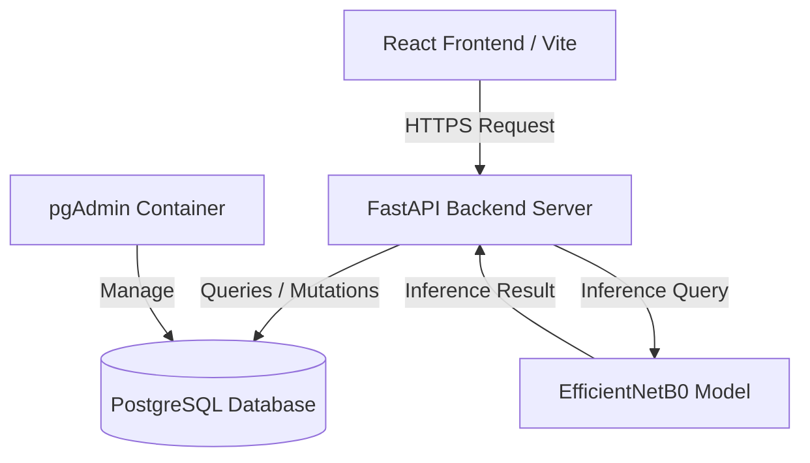

# LeafSense AI – Plant Health Management Platform

LeafSense AI is an enterprise-grade, AI-powered plant health management platform designed to detect plant diseases from uploaded leaf images using transfer learning techniques with deep convolutional neural networks.

---

## 🏗️ Architecture Overview

The application utilizes a modular, decoupled architecture consisting of:
1. **Frontend**: A highly responsive single page React application built on Vite and styled using Tailwind CSS, showcasing interactive metrics and predictive analysis components.
2. **Backend**: A high-performance FastAPI service implementing JWT authentication, database connections using SQLAlchemy (PostgreSQL), and endpoint services.
3. **Machine Learning**: An image classification pipeline implementing Transfer Learning via EfficientNetB0, yielding model assets for automated disease detection.
4. **Database & Infrastructure**: PostgreSQL running inside Docker (development) transitioning to AWS RDS (production), with pgAdmin for local administration.



---

## 🛠️ Technology Stack

| Layer | Technology |
| :--- | :--- |
| **Frontend** | React, Vite, Tailwind CSS, React Router, Axios, Recharts |
| **Backend** | FastAPI, SQLAlchemy (v2.0), Alembic, Pydantic (v2.0), JWT Authentication, Passlib |
| **Machine Learning** | TensorFlow (Transfer Learning), OpenCV, NumPy, Scikit-learn, Matplotlib |
| **Database** | PostgreSQL (Docker for Local Dev, Amazon RDS for Production) |
| **Containerization** | Docker, Docker Compose |
| **Hosting (Target)** | AWS Amplify (Frontend), AWS EC2 (Backend), Amazon RDS (Database), Amazon S3 (Media) |

---

## 📂 Project Directory Structure

```text
LeafSense-AI/
├── frontend/                 # React frontend application
├── backend/                  # FastAPI backend server
│   ├── app/
│   │   ├── api/              # Route controllers/endpoints
│   │   ├── auth/             # Authentication & JWT services
│   │   ├── core/             # Configuration & security setups
│   │   ├── database/         # Database sessions and connection sessions
│   │   ├── models/           # SQLAlchemy database schemas
│   │   ├── schemas/          # Pydantic schemas for request/response validation
│   │   ├── services/         # Business logic layer (Repository pattern)
│   │   ├── utils/            # Shared utility functions
│   │   └── main.py           # Application entrypoint
│   ├── requirements.txt      # Backend Python dependencies
│   └── .env.example          # Backend configuration template
├── ml/                       # Machine Learning codebase
│   ├── dataset/              # PlantVillage images split (train, valid, test)
│   ├── models/               # Saved checkpoints and models
│   ├── saved_model/          # Serialized production models (.keras / .h5)
│   ├── training/             # Custom model trainer scripts
│   ├── train.py              # ML pipeline training script
│   ├── predict.py            # Local model prediction script
│   └── requirements.txt      # Machine Learning dependencies
├── deployment/
│   └── docker/
│       ├── docker-compose.yml # PostgreSQL and pgAdmin orchestration
│       └── .env.example      # Docker Compose configuration template
├── docs/                     # Architectural diagrams, user manuals & guides
└── README.md                 # Primary project documentation
```

---

## 🚀 Step 1: Getting Started

### Prerequisites
Make sure you have the following installed on your developer machine:
- [Docker Desktop](https://www.docker.com/products/docker-desktop/) (ensure it is running)
- [Python 3.10+](https://www.python.org/downloads/)
- [Node.js v18+](https://nodejs.org/)

---

### Database Setup

1. Navigate to the docker deployment directory:
   ```bash
   cd deployment/docker
   ```

2. Copy the example environment file to `.env`:
   ```bash
   cp .env.example .env
   ```

3. Start the Postgres database and pgAdmin containers:
   ```bash
   docker-compose up -d
   ```

4. Verify that the containers are healthy and running:
   ```bash
   docker-compose ps
   ```

5. Access local database administration:
   - **pgAdmin Console**: [http://localhost:5050](http://localhost:5050)
   - **Username**: `admin@leafsense.ai` (as configured in `deployment/docker/.env`)
   - **Password**: `pgadmin_secure_pass_2026`

---

### Python Environments Setup

It is recommended to run virtual environments for separate services (Backend and ML pipeline) to avoid dependency version conflicts.

#### Backend Env Setup
```bash
cd backend
python3 -m venv .venv
source .venv/bin/activate
pip install --upgrade pip
pip install -r requirements.txt
cp .env.example .env
```

#### ML Env Setup
```bash
cd ml
python3 -m venv .venv
source .venv/bin/activate
pip install --upgrade pip
pip install -r requirements.txt
```

---

## 🗺️ Project Roadmap

- [x] **STEP 1: Project Setup** - Directory layout, Python requirements, Docker Compose for Database & pgAdmin.
- [ ] **STEP 2: Machine Learning** - Train EfficientNetB0 on PlantVillage dataset, validation curves, prediction script.
- [ ] **STEP 3: Backend APIs** - FastAPI endpoints, Repository patterns, JWT authentication, prediction storage.
- [ ] **STEP 4: Frontend UI** - React UI with Tailwind, dashboard metrics, interactive upload component, and charts.
- [ ] **STEP 5: Dockerization** - Full multi-container Docker deployment (FastAPI, React, PostgreSQL).
- [ ] **STEP 6: Quality Assurance** - Backend unit tests, frontend integrations, and validation testing.
- [ ] **STEP 7: AWS Deployment** - Deploying to AWS Amplify, EC2, RDS PostgreSQL, and S3 buckets.
- [ ] **STEP 8: Documentation & Showcase** - Final API documentation, architectural manuals, and deployment logs.
